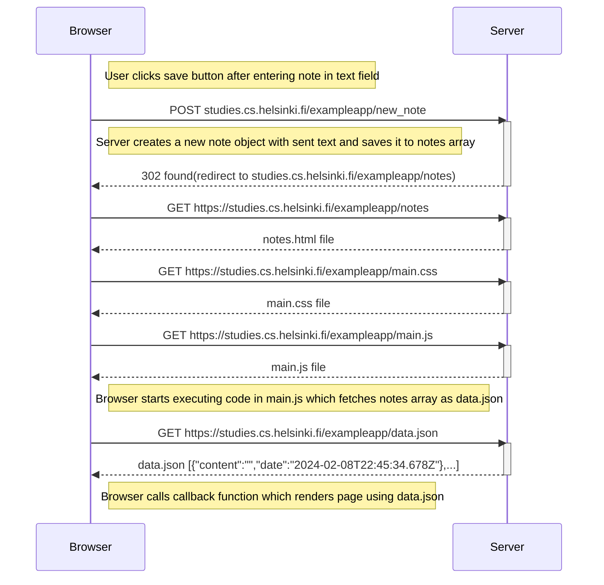

```mermaid
sequenceDiagram
  participant B as Browser
  participant S as Server

  Note right of B: User clicks save button after entering note in text field

  B->>S: POST studies.cs.helsinki.fi/exampleapp/new_note
  activate S
  Note right of B: Server creates a new note object with sent text and saves it to notes array
  S-->>B: 302 found(redirect to studies.cs.helsinki.fi/exampleapp/notes)
  deactivate S

  B->>S: GET https://studies.cs.helsinki.fi/exampleapp/notes
  activate S
  S-->>B: notes.html file
  deactivate S

  B->>S: GET https://studies.cs.helsinki.fi/exampleapp/main.css
  activate S
  S-->>B: main.css file
  deactivate S

  B->>S: GET https://studies.cs.helsinki.fi/exampleapp/main.js
  activate S
  S-->>B: main.js file
  deactivate S

  Note right of B: Browser starts executing code in main.js which fetches notes array as data.json

  B->>S: GET https://studies.cs.helsinki.fi/exampleapp/data.json
  activate S
  S-->>B: data.json [{"content":"","date":"2024-02-08T22:45:34.678Z"},...]
  deactivate S

  Note right of B: Browser calls callback function which renders page using data.json
```
