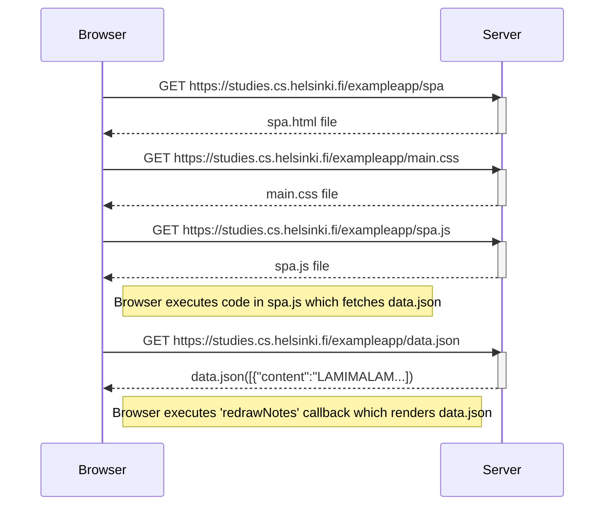

```mermaid
sequenceDiagram
  participant B as Browser
  participant S as Server

  B->>S: GET https://studies.cs.helsinki.fi/exampleapp/spa
  activate S
  S-->>B: spa.html file
  deactivate S

  B->>S: GET https://studies.cs.helsinki.fi/exampleapp/main.css
  activate S
  S-->>B: main.css file
  deactivate S

  B->>S: GET https://studies.cs.helsinki.fi/exampleapp/spa.js
  activate S
  S-->>B: spa.js file
  deactivate S

  Note right of B: Browser executes code in spa.js which fetches data.json

  B->>S: GET https://studies.cs.helsinki.fi/exampleapp/data.json
  activate S
  S-->>B: data.json([{"content":"LAMIMALAM...])
  deactivate S

  Note right of B: Browser executes 'redrawNotes' callback which renders data.json
```
