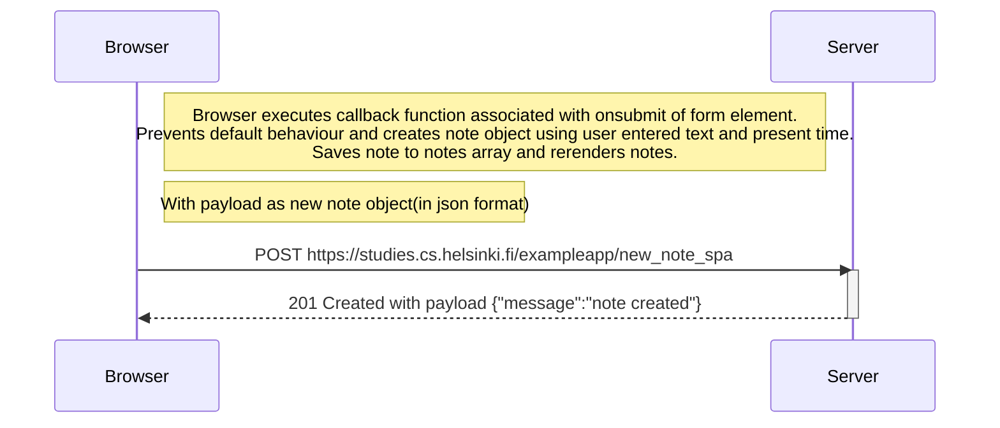

```mermaid
sequenceDiagram
  participant B as Browser
  participant S as Server

  Note right of B: Browser executes callback function associated with onsubmit of form element.<br>Prevents default behaviour and creates note object using user entered text and present time.<br>Saves note to notes array and rerenders notes.

  Note right of B: With payload as new note object(in json format)
  B->>S: POST https://studies.cs.helsinki.fi/exampleapp/new_note_spa
  activate S
  S-->>B: 201 Created with payload {"message":"note created"}
  deactivate S
```
